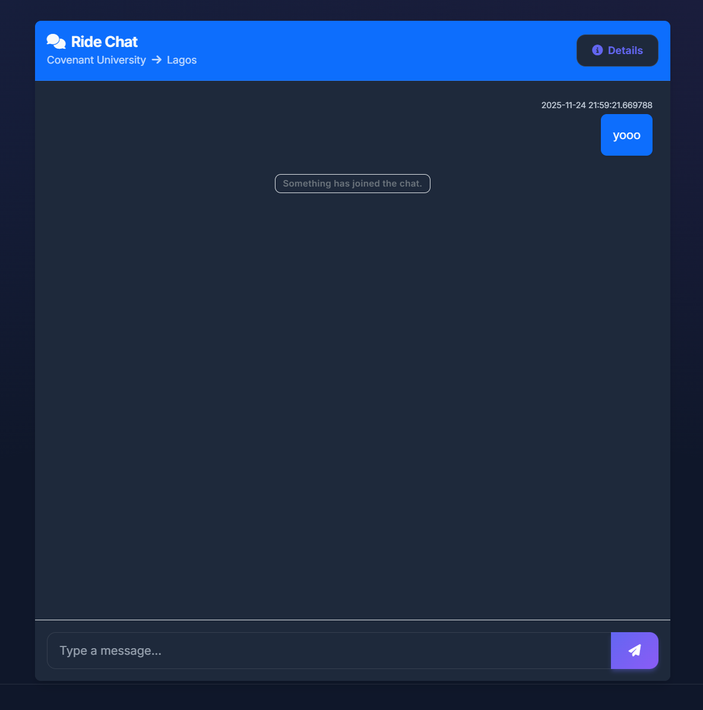
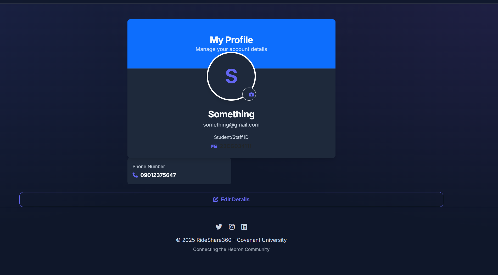

# FLB Extended — Nigerian Agricultural Platform


A comprehensive platform connecting farmers, workers, realtors, and service providers across Nigeria's agricultural ecosystem. FLB Extended empowers the agricultural community with AI-driven tools, a robust marketplace, and secure transaction systems.

## 📋 Table of Contents

- [Project Overview](#-project-overview)
- [Key Features](#-key-features)
- [Screenshots](#-screenshots)
- [Installation](#-installation)
- [Usage](#-usage)
- [Project Structure](#-project-structure)
- [Tech Stack](#-tech-stack)
- [API Documentation](#-api-documentation)
- [Contributing](#-contributing)
- [License](#-license)
- [Contact](#-contact)

## 🌟 Project Overview

FLB Extended is a full-stack agricultural marketplace and assistance platform built with Flask and SQLAlchemy. It addresses critical gaps in the Nigerian agricultural sector by:

*   **Connecting Stakeholders:** Bridging the gap between farmers, skilled laborers, and land owners.
*   **Optimizing Production:** Providing AI-powered tools for crop selection, cost estimation, and shelf-life prediction.
*   **Ensuring Trust:** Implementing rigorous user verification (NIN, Passport) and secure contract systems.
*   **Facilitating Commerce:** Offering a seamless marketplace for real estate and labor, backed by a digital wallet system.

## 🚀 Key Features

### 1. User Management & Verification
*   **Multi-Role System:** Dedicated accounts for Farmers, Workers, Realtors, and Admins.
*   **Identity Verification:** Secure upload and admin review of government IDs (NIN, Passport, Driver's License).
*   **Security:** Password hashing, rate limiting, and secure headers.

### 2. Agricultural Marketplace
*   **Real Estate:** Buy, sell, or lease agricultural land with detailed filtering.
*   **Worker Directory:** Find and hire skilled agricultural workers based on specialization and location.
*   **Produce Assistant:**
    *   **Cost Calculator:** Estimate total production costs (seeds, labor, fertilizer, etc.).
    *   **Shelf Life Predictor:** AI-based estimation of produce longevity.
    *   **Crop Recommender:** Data-driven crop suggestions based on soil and climate data.

### 3. Communication & Contracts
*   **Messaging System:** Real-time communication between users.
*   **Digital Contracts:** Legally binding agreements for services and sales.
*   **Secure Signatures:** Two-party digital signing workflow.

### 4. Financial System
*   **Digital Wallet:** Integrated wallet for holding and transferring funds.
*   **Transaction History:** Detailed logs of all financial activities.
*   **Payment Integration:** (In Progress) Interswitch integration for seamless payments.

### 5. Community & Support
*   **Forum:** Community discussions, Q&A, and knowledge sharing.
*   **Rating System:** 5-star reviews for workers and realtors.
*   **Admin Dashboard:** Comprehensive tools for moderation, user management, and system oversight.

## 📸 Screenshots

| Dashboard | Marketplace |
|:---------:|:-----------:|
|  |  |

| Listing Details | User Profile |
|:---------------:|:------------:|
|  |  |

## 💻 Installation

### Prerequisites
*   Python 3.13+
*   Git

### Steps

1.  **Clone the repository**
    ```bash
    git clone https://github.com/Pingwyd/FLB-Extended.git
    cd "FLB extended"
    ```

2.  **Create a virtual environment**
    ```bash
    # Windows
    python -m venv .venv
    .\.venv\Scripts\Activate.ps1

    # Linux/Mac
    python3 -m venv .venv
    source .venv/bin/activate
    ```

3.  **Install dependencies**
    ```bash
    pip install -r requirements.txt
    ```

4.  **Initialize the database**
    The database `flb.db` will be automatically created when you run the application for the first time.

## 🏃 Usage

1.  **Start the application**
    ```bash
    python app.py
    ```

2.  **Access the platform**
    Open your browser and navigate to `http://localhost:5000`.

3.  **Run Tests**
    ```bash
    pytest
    ```

## 📁 Project Structure

```
FLB extended/
├── app.py                          # Main Application Entry Point
├── models.py                       # Database Models
├── calculator.py                   # Produce Assistant Logic
├── config.py                       # Configuration
├── templates/                      # HTML Templates
├── static/                         # Static Assets (CSS, JS, Images)
├── tests/                          # Test Suite
├── Guides/                         # Implementation Guides
└── txts/                           # Project Documentation
```

## 🔧 Tech Stack

*   **Backend:** Python, Flask
*   **Database:** SQLAlchemy (SQLite/PostgreSQL)
*   **Frontend:** HTML5, CSS3, JavaScript (Alpine.js/Tailwind)
*   **Authentication:** Flask-JWT-Extended
*   **Testing:** Pytest

## 📚 API Documentation

The API documentation is available via Swagger UI when the application is running:
*   **URL:** `http://localhost:5000/api/docs`
*   **Spec:** `openapi.yaml`

## 🤝 Contributing

Contributions are welcome! Please feel free to submit a Pull Request.

1.  Fork the project
2.  Create your feature branch (`git checkout -b feature/AmazingFeature`)
3.  Commit your changes (`git commit -m 'Add some AmazingFeature'`)
4.  Push to the branch (`git push origin feature/AmazingFeature`)
5.  Open a Pull Request

## 📄 License

Distributed under the MIT License. See `LICENSE` for more information.

## 📞 Contact

**Prosperr** - [GitHub Profile](https://github.com/Pingwyd)

Project Link: [https://github.com/Pingwyd/FLB-Extended](https://github.com/Pingwyd/FLB-Extended)